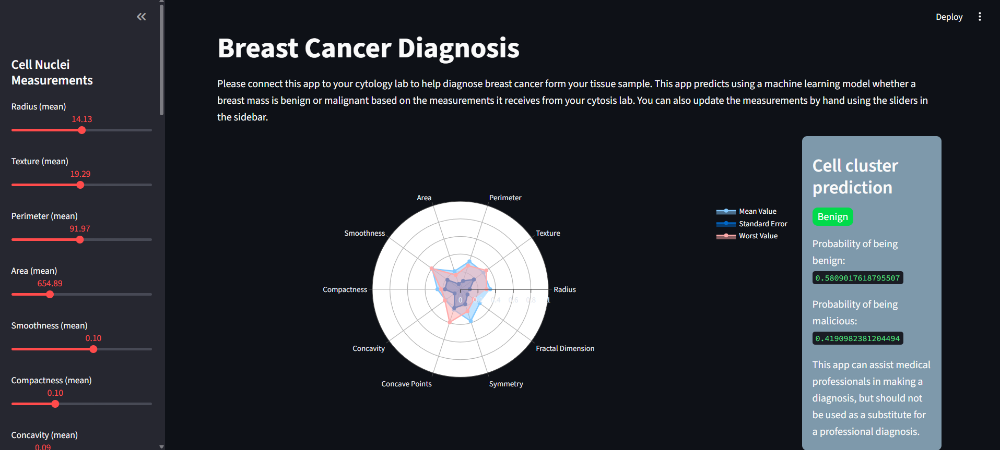

# Breast Cancer Predictor

## 📋 Proje Hakkında

Bu proje, meme kanseri teşhisine yardımcı olmak için makine öğrenmesi tabanlı bir web uygulamasıdır. Streamlit kullanılarak geliştirilmiş interaktif bir arayüz üzerinden, hücre çekirdeği ölçümlerine dayalı olarak bir meme kütlesinin iyi huylu (benign) veya kötü huylu (malignant) olup olmadığını tahmin eder.



## 🎯 Özellikler

- **İnteraktif Kullanıcı Arayüzü**: Streamlit tabanlı kullanıcı dostu web arayüzü
- **30 Farklı Ölçüm Parametresi**: Hücre çekirdeği özelliklerini içeren kapsamlı girdi sistemi
- **Radar Grafik Görselleştirme**: Ölçümlerin ortalama, standart hata ve en kötü değerlerini gösteren interaktif radar chart
- **Gerçek Zamanlı Tahmin**: Lojistik regresyon modeli kullanarak anlık tahmin
- **Olasılık Analizi**: İyi huylu ve kötü huylu olma olasılıklarını yüzde olarak gösterir

## 🛠️ Teknolojiler

- **Python 3.x**
- **Streamlit**: Web arayüzü
- **Pandas**: Veri işleme
- **Scikit-learn**: Makine öğrenmesi modeli
- **Plotly**: Veri görselleştirme
- **NumPy**: Sayısal hesaplamalar
- **Pickle**: Model serileştirme

## 📁 Proje Yapısı

```
project/
│
├── main.py                 # Streamlit web uygulaması
├── model/
│   ├── model.pkl          # Eğitilmiş lojistik regresyon modeli
│   └── scaler.pkl         # StandardScaler objesi
├── data/
│   └── data.csv           # Breast Cancer Wisconsin veri seti
├── assets/
│   └── style.css          # Özel CSS stilleri
└── README.md
```

## 🚀 Kurulum

1. Repoyu klonlayın:

```bash
git clone <repository-url>
cd breast-cancer-predictor
```

2. Gerekli kütüphaneleri yükleyin:

```bash
pip install pandas scikit-learn streamlit plotly numpy
```

3. Modeli eğitin (ilk çalıştırmada):

```bash
python model/main.py
```

4. Streamlit uygulamasını çalıştırın:

```bash
streamlit run main.py
```

## 📊 Kullanım

1. Uygulama başlatıldığında, sol taraftaki sidebar'da 30 farklı hücre çekirdeği ölçümü için kaydırıcılar (sliders) göreceksiniz.

2. Her bir parametre için değerleri ayarlayın:

   - **Mean değerleri**: Ortalama ölçümler
   - **SE (Standard Error) değerleri**: Standart hata değerleri
   - **Worst değerleri**: En kötü (maksimum) değerler

3. Değerler değiştikçe:

   - Radar grafik otomatik olarak güncellenir
   - Tahmin sonucu ve olasılıklar gerçek zamanlı olarak hesaplanır

4. Sonuçlar:
   - **Yeşil etiket**: İyi huylu (Benign)
   - **Kırmızı etiket**: Kötü huylu (Malicious)
   - Her iki durumun olasılık yüzdeleri gösterilir

## 🧠 Model Detayları

### Veri Seti

- **Kaynak**: Breast Cancer Wisconsin (Diagnostic) Data Set
- **Özellik Sayısı**: 30 (radius, texture, perimeter, area, smoothness, vb.)
- **Hedef Değişken**: Diagnosis (M = Malignant, B = Benign)

### Model

- **Algoritma**: Logistic Regression
- **Ön İşleme**: StandardScaler ile normalizasyon
- **Train-Test Oranı**: 80-20
- **Random State**: 42

### Model Eğitimi

Model eğitimi için `model/main.py` dosyası kullanılır:

- Veri temizleme ve hazırlama
- StandardScaler ile normalizasyon
- Lojistik regresyon modelinin eğitilmesi
- Model ve scaler'ın pickle formatında kaydedilmesi

## ⚠️ Önemli Notlar

> **Uyarı**: Bu uygulama tıbbi profesyonellere yardımcı olmak için tasarlanmıştır ancak profesyonel bir teşhisin yerine geçmemelidir. Kesin tanı için mutlaka bir uzmana başvurun.

## 🎨 Özelleştirme

CSS stilleri `assets/style.css` dosyasında tanımlanmıştır:

- Sidebar background color
- Diagnosis etiket renkleri (yeşil/kırmızı)
- Border radius ve padding değerleri

## 📈 Model Performansı

Model eğitimi sırasında accuracy score ve classification report konsola yazdırılır. Bu metrikleri görmek için model eğitim scriptini çalıştırın.

## 🤝 Katkıda Bulunma

Katkılarınızı bekliyoruz! Lütfen pull request göndermeden önce değişikliklerinizi test edin.

## 📝 Lisans

Bu proje eğitim amaçlı geliştirilmiştir.

## 👨‍💻 Geliştirici

Sorularınız için iletişime geçebilirsiniz.

---

**Not**: Uygulamayı ilk kez çalıştırmadan önce modeli eğitmeyi unutmayın!
